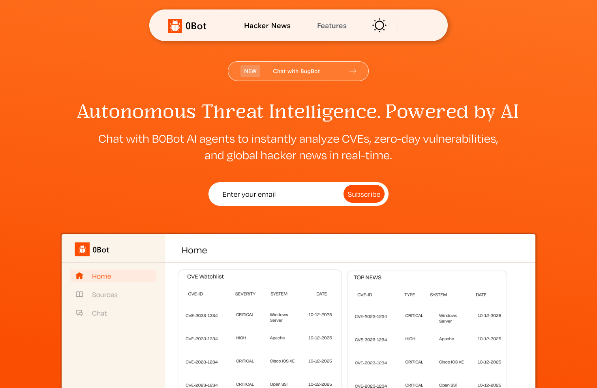
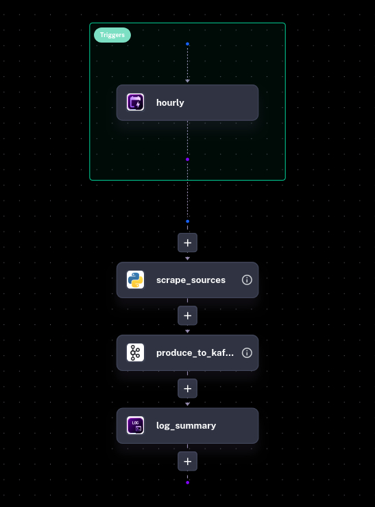
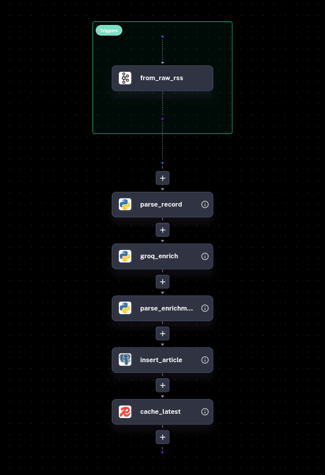
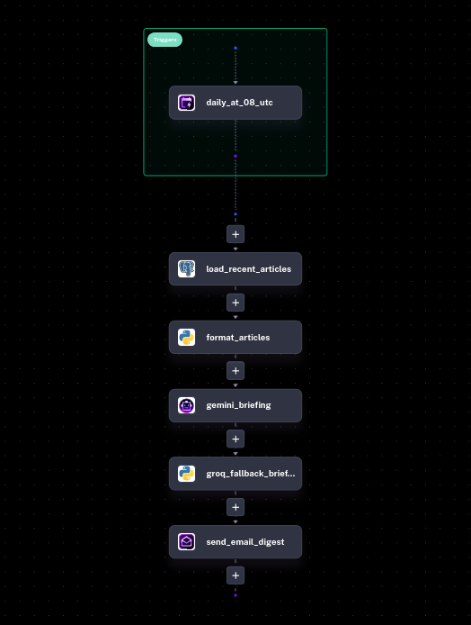
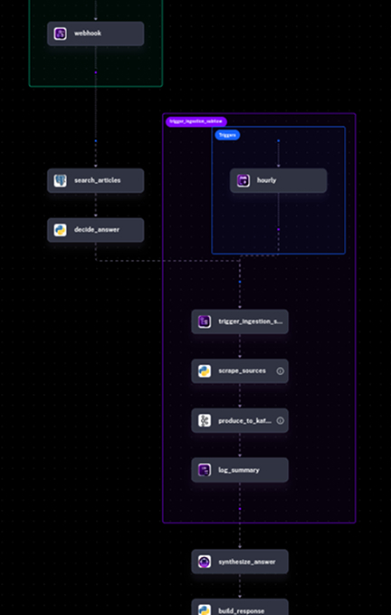

# B0bot
<p align="center">
  
</p>


**AI-driven Cybersecurity Threat Intelligence Pipeline**

B0bot is **Kestra** driven Cybersecurity Threat Intelligence (CTI) pipeline. It continuously scrapes the web for the latest security advisories, vulnerability disclosures, and cyber news, enriches them using Large Language Models (LLMs), and makes the data instantly accessible through a conversational Retrieval-Augmented Generation (RAG) interface and structured REST APIs.

---

## The Problem

In cybersecurity, time is everything. SOC analysts, IT admins, and researchers are bombarded daily by a fragmented wall of noise: new CVEs, ransomware campaigns, phishing tactics, and nation-state advisories scattered across dozens of RSS feeds and government websites.

- **Parsing data manually is slow.**
- **Identifying entities** (malware families, threat actors, affected products) **takes time.**
- **Connecting a newly announced vulnerability to past reports is tedious.**

---

## Tech Stack

| Layer | Technology | Role |
|-------|-----------|------|
| **Orchestration** | Kestra | Entire backend orchestration engine — schedules, connects, and monitors all pipelines |
| **Message Queue** | Apache Kafka | Buffers raw scraped articles between ingestion and enrichment |
| **LLM Providers** | Gemini + Groq | AI-powered entity extraction, classification, and conversational RAG |
| **Database** | PostgreSQL | Stores enriched articles metadata and supports search queries |
| **Cache** | Redis | Caches latest headlines for low-latency access |
| **Frontend** | Next.js (React) | Chat interface and REST API dashboard |

---

## Flows

### 1. Data Ingestion — `b0bot_ingestion.yml`

<p align="center">
  
</p>

- Scrapes **3 RSS feeds** (TheHackerNews, KrebsOnSecurity, BleepingComputer) and **2 HTML pages** (CISA, NCSC) on an hourly schedule.
- Parses each entry into a structured JSON record containing title, link, and source name.
- Publishes every record to the Kafka topic `raw.rss` for downstream processing.
- Runs automatically every hour with zero manual intervention.

---

### 2. AI Enrichment — `b0bot_enrichment.yml`

<p align="center">
  
</p>

- Consumes raw records from the Kafka topic `raw.rss` in real time.
- Sends each article headline to **Groq (llama-3.1-8b-instant)** for classification — extracts category, severity, and named entities (CVEs, malware families, threat actors).
- Inserts the enriched record into **PostgreSQL** (`articles_metadata`) with upsert logic to avoid duplicates.
- Caches the latest headline in **Redis** under the key `latest_cyber_news`.

---

### 3. Daily Threat Briefing — `b0bot_daily_notification.yml`

<p align="center">
  
</p>

- Runs every day at **08:00 UTC** on a cron schedule.
- Pulls the **10 most recent articles** from PostgreSQL and formats them into a digest.
- Uses **Gemini (gemini-2.5-flash-lite)** to generate a plain-English cyber threat briefing in HTML format — falls back to **Groq** if Gemini fails.
- Sends the briefing as an **email** via SMTP to configured recipients.

---

### 4. Conversational RAG — `b0bot_chat_rag.yml`

<p align="center">
  
</p>

- Exposes a **webhook endpoint** that accepts a user question via POST request.
- Searches PostgreSQL for matching articles using ILIKE on headline and entity fields.
- If matches are found, **Gemini (gemini-2.5-flash-lite)** synthesizes a natural-language answer from the context.
- If no matches exist, it **automatically triggers the ingestion subflow** to fetch new intelligence and returns a fallback message.

---

## Setup

### Prerequisites

- [Docker](https://docs.docker.com/get-docker/) & Docker Compose
- [Node.js](https://nodejs.org/) v18+ and [pnpm](https://pnpm.io/)
- API keys for **Gemini** and **Groq**

### Step 1 — Clone the repository

```bash
git clone https://github.com/your-org/b0bot.git
cd b0bot
```

### Step 2 — Configure environment variables

```bash
cd kestra-infra
cp .env.example .env
```

Edit `.env` and fill in your API keys:

```env
GEMINI_API_KEY=your_gemini_api_key
GROQ_API_KEY=your_groq_api_key
```

### Step 3 — Start the infrastructure

```bash
docker compose up -d
```

This spins up:

| Service | Port |
|---------|------|
| Kestra | `8080` |
| PostgreSQL | `5432` |
| Redis | `6379` |
| Kafka | `9092` |

### Step 4 — Import Kestra flows

1. Open Kestra UI at [http://localhost:8080](http://localhost:8080)
2. Navigate to **Flows → Import**
3. Import all 4 flow files from `kestra-flows/`:
   - `b0bot_ingestion.yml`
   - `b0bot_enrichment.yml`
   - `b0bot_daily_notification.yml`
   - `b0bot_chat_rag.yml`

### Step 5 — Set up Kestra secrets

In Kestra UI, go to **Settings → Secrets** and add:

| Secret Name | Value |
|-------------|-------|
| `POSTGRES_USER` | `kestra` |
| `POSTGRES_PASSWORD` | `k3str4` |
| `GEMINI_API_KEY` | your key |
| `GROQ_API_KEY` | your key |

### Step 6 — Start the frontend

```bash
cd frontend
pnpm install
pnpm dev
```

Frontend is now live at [http://localhost:3000](http://localhost:3000).

---

## License

MIT
